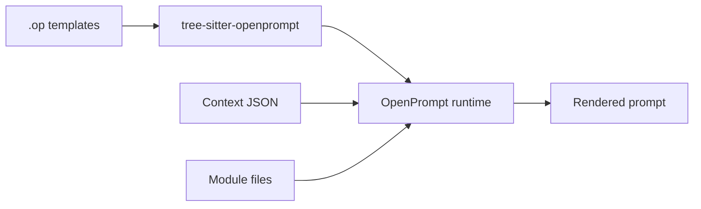

# OpenPrompt

A template language and runtime for LLM prompts.

OpenPrompt is a small templating engine I built for internal agents and AI apps. You write `.op` files with variables, conditionals, loops, and reusable modules, then render them from Node, native code, or eventually the browser.

> Early stage. This started as an internal tool and is still moving. Language, APIs, and layout may change.

Language docs: [OpenPrompt Language Handbook](docs/README.md)

---

## Why bother?

Most LLM apps end up needing the same stuff:

- Structured prompts (system instructions, user context, tool output)
- Shared snippets across agents
- Runtime data wired in per request
- Prompt source that reads like Markdown, not `+` chains in code

OpenPrompt treats prompts as templates: parseable, composable, callable from any binding.

---

## Template language

Files use `.op`, `.openprompt`, or `.prompt`. They mix Markdown-ish text with directives (`[[@if]]`, `[[@for]]`, `[[@use]]`, …) and expressions (`{{ $user.name }}`).

```op
[[@use "common.op" as $prompts]]

# Hello {{ $user.name }}

{{ $prompts.example }}

[[@for $item in items]]
- {{ $item.name }}
[[@end]]
```

Full spec lives in the [Language Handbook](docs/README.md). Sample files: [`modules/tree-sitter/examples/`](modules/tree-sitter/examples/)

---

## Quick start

### TypeScript / Node.js

```bash
cd modules/binding/ts
pnpm install
pnpm run build:native
pnpm run build
```

One-shot render:

```typescript
import { render } from "@openprompt/binding";

const output = render(
  `[[@use "common.op" as $prompts]]
Hello {{ $user.name }}
{{ $prompts.example }}`,
  { user: { name: "Ada", age: 18 } },
  {
    basePath: "basic.op",
    modules: {
      "common.op": '[[@template example]]\n\n## Example Section\n\n[[@end]]\n',
    },
  },
);

console.log(output);
```

Engine you reuse:

```typescript
import { createEngine } from "@openprompt/binding";

const engine = createEngine({
  searchPaths: ["./prompts"],
});

engine.loadFile("./prompts/review.op");
engine.setContext({
  user: { name: "Ada", age: 18 },
  items: [{ name: "one" }, { name: "two" }],
});

const prompt = engine.render();
```

On native targets, `OPENPROMPT_SEARCH_PATHS` is a colon-separated list of dirs for `@use` / `@inject` lookup (stdio VFS).

---

## Architecture

```text
.op template
  → Tree-sitter parser
  → Evaluator
  → Rendered prompt string
```



| Module | Purpose |
|--------|---------|
| [`modules/tree-sitter/`](modules/tree-sitter/) | Grammar, queries, editor highlighting |
| [`modules/binding/`](modules/binding/) | C++ core + TS, Zig, Java, Lua bindings |
| [`modules/lsp/`](modules/lsp/) | LSP: diagnostics, completion, hover, go-to-definition |

---

## Language bindings

Shared API across bindings:

```text
createEngine({ searchPaths?, modules? })
loadString(source, { basePath? })
loadFile(path)
registerModule(path, source)
setContext(map)
render() → string
```

| Binding | Path | Notes |
|---------|------|-------|
| TypeScript / Node | [`modules/binding/ts/`](modules/binding/ts/) | N-API addon |
| Browser | [`modules/binding/ts/`](modules/binding/ts/) | WASM locally, or `renderRemote()` |
| Zig | [`modules/binding/zig/`](modules/binding/zig/) | `@cImport` |
| Java | [`modules/binding/java/`](modules/binding/java/) | Panama FFM |
| Lua | [`modules/binding/lua/`](modules/binding/lua/) | C module |

Build per target: [`modules/binding/README.md`](modules/binding/README.md)

---

## Editor support

Grammar language id: `openprompt`. Extensions: `.op`, `.openprompt`, `.prompt`.

- Highlighting: [`modules/tree-sitter/queries/`](modules/tree-sitter/queries/)
- LSP: [`modules/lsp/`](modules/lsp/) (Zig, stdio)
- Neovim: [`modules/tree-sitter/README.md`](modules/tree-sitter/README.md)

---

## Development

```bash
# Grammar
cd modules/tree-sitter
pnpm install
pnpx tree-sitter generate
pnpx tree-sitter test

# Native core + bindings
cd modules/binding/cpp
cmake -B build -DCMAKE_BUILD_TYPE=Release
cmake --build build
ctest --test-dir build --output-on-failure

# TypeScript binding
cd ../ts
pnpm install && pnpm run build:native && pnpm run build && pnpm test
```

Golden vectors: [`modules/binding/tests/vectors/`](modules/binding/tests/vectors/)

---

## Project status

Starting point, not a finished product. Today:

- Template language (variables, conditionals, loops, modules, Markdown passthrough)
- Tree-sitter grammar + LSP groundwork
- Native runtime; TS, Zig, Java, Lua bindings

Maybe later (no promises): CLI, published packages, browser WASM, more builtins.

Pin a commit if you depend on this internally. Expect breakage until things settle.

---

## License

MIT.
