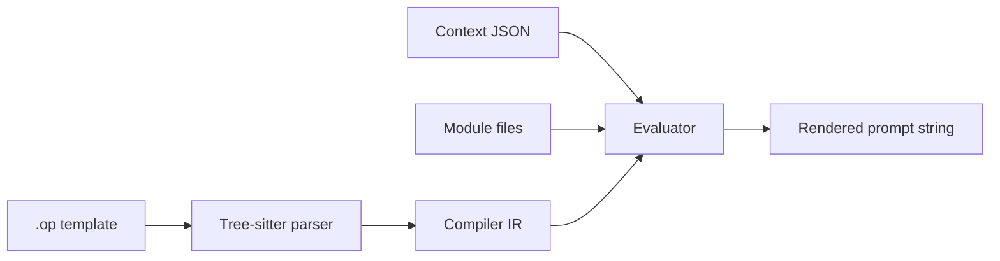

# Introduction

OpenPrompt is a template language for LLM prompts. Write `.op` files instead of building prompt strings in code.

Prompts are documents. They can hold Markdown-style text, pull in runtime data, skip or include sections, loop over lists, and import pieces from other files.

Built for internal agents and AI tooling, but the idea is general: readable prompt source that still executes like a small template language.

---

## The usual pain

LLM apps tend to grow the same wiring:

- Fixed system instructions
- Per-user context at call time
- Optional blocks by role or feature flag
- Bullet lists built from search results or tool output
- Same snippet copy-pasted across agents

Without templates that turns into nested concatenation and prompts nobody wants to diff. OpenPrompt keeps the text readable and puts the logic in the language.

---

## Three inputs, one output

| Input    | What it is                               |
|----------|------------------------------------------|
| Template | `.op` source                             |
| Context  | JSON runtime data                        |
| Modules  | Other `.op` files via `@use` / `@inject` |

Output is always one plain string: the prompt you send to the model.

---

## Rendering pipeline

No regex engine. Tree-sitter parses the file, a compiler builds IR, a native evaluator walks it.



Steps:

1. Parse → syntax tree
2. Compile → evaluable nodes (directives, expressions, text regions)
3. Evaluate → resolve vars, run `@if` / `@for`, load modules
4. Output → markdown text copied verbatim; dynamic bits substituted

---

## Syntax layers

### Markdown content

Headings, lists, blockquotes, fenced code pass through as text. OpenPrompt recognizes common line shapes; it is not a Markdown compiler.

### Directives

Double-bracket tags for control flow and imports:

```op
[[@use "common.op" as $prompts]]
[[@if $user.premium]]
[[@for $item in items]]
[[@inject "footer.op"]]
[[@template sidebar]]
[[@end]]
```

### Expressions

Double-brace interpolation:

```op
Hello {{ $user.name }}
```

---

## Scope of this handbook

Language only: syntax, semantics, runtime behavior.

Binding build steps and app integration: [binding README](../modules/binding/README.md).

---

## Status

Not a frozen spec yet. Things get added, renamed, dropped. Sharp edges (condition precedence, string escapes) are called out in later chapters.

Until there's a version number, treat the runtime + this doc as the spec.

---

## Next

- [Getting Started](02-getting-started.md)
- [Template Structure](03-template-structure.md)
- [Language Reference](15-language-reference.md)
