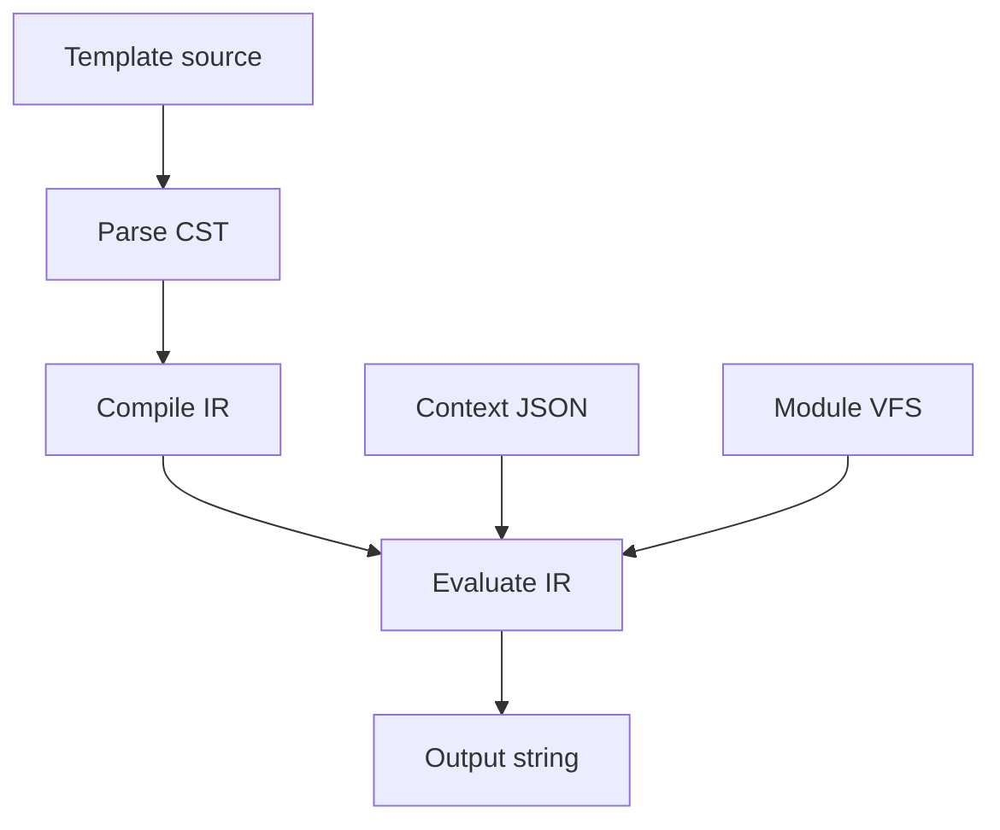

# Rendering and scoping

How the evaluator turns compiled IR into a string: order of operations and where names come from.

---

## Pipeline



1. Parse (Tree-sitter CST)
2. Compile (IR nodes: text, interpolation, conditional, loop, inject)
3. Evaluate (append to output buffer)

Per-module compile. `@use` / `@inject` load more modules on demand.

---

## Module render

1. Process top-level `@use` bindings
2. Walk document body IR
3. Append to output

`@template` blocks go in an export table; not walked for document render.

---

## IR nodes

| Kind | Action |
|------|--------|
| Text | Copy source bytes |
| Interpolation | Resolve, coerce, append |
| Inject | Render target module body, append |
| Conditional | Eval condition, append one branch |
| ForLoop | For each array element, append body |

---

## Scope

Lexical scoping. `@for` gets explicit child scopes.

### Context roots

```json
{ "user": { "name": "Ada" }, "items": [] }
```

→ `$user`, `$items`

### `@use`

| Value | Effect |
|-------|--------|
| String path | Module alias → `$alias.templateName` |
| Number / bool | Literal in local scope as `$alias` |

Module aliases aren't context values. They point at loaded modules.

### Loop locals

```text
child_scope = copy(parent_scope)
child_scope[loop_var] = current_element
```

Loop var shadows same name in parent for the body.

---

## Resolution order

Interpolation and conditions:

1. Loop locals (innermost first)
2. `@use` literals in module scope
3. Context roots

`@for` iterable:

1. Loop locals
2. Context roots

`$alias.name`: module bindings before context.

---

## Sub-prompt render

For `$prompts.example` or `$prompts["example"]`:

1. Find module binding for `$prompts`
2. Look up template `example`
3. Render template body with fresh empty scope
4. Return string (appended where interpolation was)

Loop vars don't flow into sub-prompts unless the data is on context roots.

---

## `@inject`

Renders target document body at injection point. Injected module:

- Runs its own `@use`
- Doesn't inline `@template` unless body references them
- Gets same context JSON as top-level render

---

## Module cache

Loaded modules cached by normalized path. Reused on repeat `@use` / `@inject`.

Load stack detects cycles → throw before infinite recursion.

---

## Errors vs silence

| | Error? |
|---|--------|
| Parse failure | Yes |
| Missing module | Yes (`unable to read module`) |
| Cyclic include | Yes |
| Missing interpolation path | No (empty string) |
| `@for` on non-array | No (skip body) |

---

## What contributes to document output

| Construct | Yes? |
|-----------|------|
| Markdown text | Yes |
| Interpolation | Yes |
| `@if` / `@for` taken bodies | Yes |
| `@inject` | Yes |
| `@use` | No |
| `@template` def | No |
| Front matter / meta | No |

---

## Related

- [Introduction](01-introduction.md)
- [Modules](08-modules.md)
- [Includes](10-includes.md)
- [Interpolation](05-interpolation.md)
